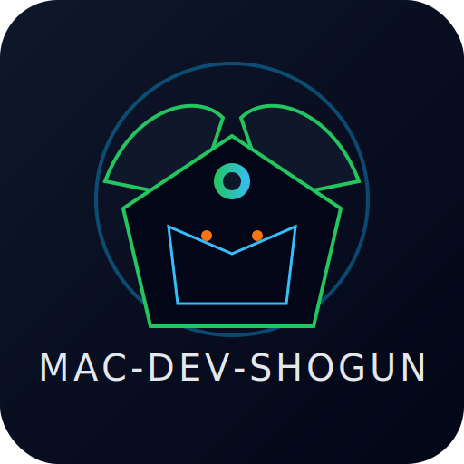

<div align="center">

# 🥷 mac-dev-shogun

### Turn Your macOS Into an AI + Crypto Engineering Workstation



[]()
[]()
[]()
[]()
[](https://github.com/shijien/mac-dev-shogun/releases)
[](./LICENSE)

</div>

---

## 📦 Overview

`mac-dev-shogun` is a fully automated **macOS developer environment bootstrapper** that transforms any Mac (M1/M2/M3) into a **world-class AI engineer + Web3 engineer workstation**.

It provides:

- **Terminal setup** (zsh, zinit, starship, fzf, ripgrep, Nerd Fonts)
- **AI tooling** (Python 3.11, Conda, PyTorch, Transformers, JupyterLab)
- **Crypto/Web3 tooling** (Foundry, Solana CLI, Rust toolchain)
- **VS Code full config** (extensions for AI, Rust, Solidity, Docker, DevContainers)
- **One-line installation**
- **Homebrew formula support**

Once installed, your Mac becomes a **battle-ready dev machine**.

---

# ⚡ One-line install

```bash
/bin/bash -c "$(curl -fsSL https://raw.githubusercontent.com/shijien/mac-dev-shogun/main/install.sh)"
```

---

# 🍺 Install via Homebrew (Recommended)

```bash
brew tap shijien/mac-dev-shogun https://github.com/shijien/mac-dev-shogun
brew install mac-dev-shogun
```

Run steps:

```bash
mac-dev-shogun dev
mac-dev-shogun tooling
mac-dev-shogun vscode
```

---

# 📁 Repository Structure

```
mac-dev-shogun/
├── setup_dev_env.sh
├── setup_ai_crypto_tooling.sh
├── setup_vscode.sh
├── install.sh
├── tag_release.sh
├── mac-dev-shogun.rb
├── logo.svg
├── README.md
├── LICENSE
└── .gitignore
```

---

# 🚀 Scripts

## 1️⃣ `setup_dev_env.sh`

ZSH, zinit, starship, Nerd Font, fzf, ripgrep, shell optimization.

```bash
./setup_dev_env.sh
source ~/.zshrc
```

---

## 2️⃣ `setup_ai_crypto_tooling.sh`

Installs:

**AI:** Conda, Python 3.11, PyTorch (CPU/MPS), Transformers, Jupyter
**Crypto:** fnm, Node.js 22, pnpm, Rust, Foundry, Solana CLI

```bash
./setup_ai_crypto_tooling.sh
source ~/.zshrc
```

---

## 3️⃣ `setup_vscode.sh`

Installs:

- Python, Pylance
- Jupyter
- Rust Analyzer
- Solidity
- ESLint + Prettier
- Docker, DevContainers
- Tokyo Night theme + Icons

```bash
./setup_vscode.sh
```

---

# 🏗 Homebrew Formula

```bash
brew tap shijien/mac-dev-shogun
brew install mac-dev-shogun
```

To update:

1. Create release
2. Compute SHA256
3. Update formula
4. Push
5. Users upgrade:

```bash
brew upgrade mac-dev-shogun
```

---

# 🧪 Recommended Python Interpreter

### Homebrew Miniforge:

```
/opt/homebrew/Caskroom/miniforge/base/envs/ai/bin/python
```

### If using symlink masking:

```
~/miniforge3/envs/ai/bin/python
```

---

# 🛡 Troubleshooting

Disable base env:

```bash
conda config --set auto_activate_base false
```

Hide from Starship:

```toml
[conda]
ignore_base = true
```

---

# 📄 License

MIT License — see [LICENSE](./LICENSE)

---

# ⭐ Support

If this repo saves you time, please ⭐ it!

---

# 🏯 Shogun Stands Ready

Your Mac is now a **battle-ready engineering workstation**.
Fast. Automated. AI-powered. Web3-enabled.

🔥🥷🔥
